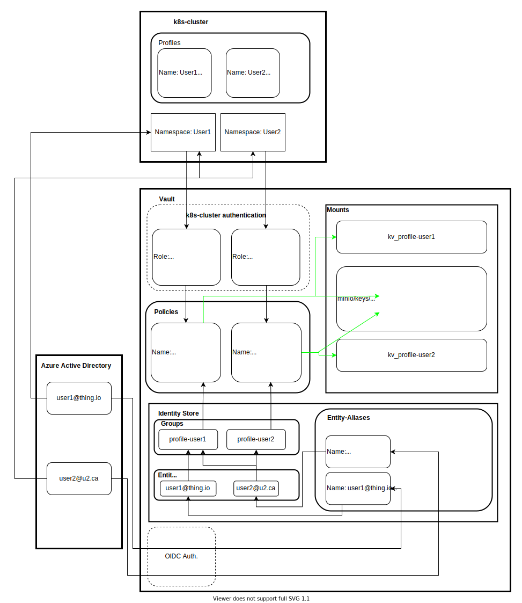

# kubeflow-controller

This repository implements a simple controller for watching Profile resources as
defined with a CustomResourceDefinition (CRD).

**Note:** go-get or vendor this package as `github.com/StatCan/kubeflow-controller`.

This particular example demonstrates how to perform basic operations such as:

* How to register a new custom resource (custom resource type) of type `Profile` using a CustomResourceDefinition.
* How to create/get/list instances of your new resource type `Profile`.
* How to setup a controller on resource handling create/update/delete events.

It makes use of the generators in [k8s.io/code-generator](https://github.com/kubernetes/code-generator)
to generate a typed client, informers, listers and deep-copy functions. You can
do this yourself using the `./hack/update-codegen.sh` script.

The `update-codegen` script will automatically generate the following files &
directories:

* `pkg/apis/kubeflowcontroller/v1/zz_generated.deepcopy.go`
* `pkg/generated/`

Changes should not be made to these files manually, and when creating your own
controller based off of this implementation you should not copy these files and
instead run the `update-codegen` script to generate your own.

## Details

The kubeflow controller uses [client-go library](https://github.com/kubernetes/client-go/tree/master/tools/cache) extensively.
The details of interaction points of the kubeflow controller with various mechanisms from this library are
explained [here](docs/controller-client-go.md).

## Fetch kubeflow-controller and its dependencies

Like the rest of Kubernetes, kubeflow-controller has used
[godep](https://github.com/tools/godep) and `$GOPATH` for years and is
now adopting go 1.11 modules.  There are thus two alternative ways to
go about fetching this demo and its dependencies.

### Fetch with godep

When NOT using go 1.11 modules, you can use the following commands.

```sh
go get -d github.com/StatCan/kubeflow-controller
cd $GOPATH/src/github.com/StatCan/kubeflow-controller
godep restore
```

### When using go 1.11 modules

When using go 1.11 modules (`GO111MODULE=on`), issue the following
commands --- starting in whatever working directory you like.

```sh
git clone https://github.com/statcan/kubeflow-controller.git
cd kubeflow-controller
```

Note, however, that if you intend to
[generate code](#changes-to-the-types) then you will also need the
code-generator repo to exist in an old-style location.  One easy way
to do this is to use the command `go mod vendor` to create and
populate the `vendor` directory.

## Purpose

This controller updates the state of Vault to allow access to secrets from OIDC users and from inside a profile's namespace.



## Running

**Prerequisite**: Since the kubeflow-controller uses `apps/v1` deployments, the Kubernetes cluster version should be greater than 1.9.

```sh
# assumes you have a working kubeconfig, not required if operating in-cluster
go build -o kubeflow-controller .
./kubeflow-controller -kubeconfig=$HOME/.kube/config

# create a CustomResourceDefinition
kubectl create -f artifacts/examples/crd.yaml

# create a custom resource of type Profile
kubectl create -f artifacts/examples/example-profile.yaml

# check deployments created through the custom resource
kubectl get deployments
```

## Use Cases

CustomResourceDefinitions can be used to implement custom resource types for your Kubernetes cluster.
These act like most other Resources in Kubernetes, and may be `kubectl apply`'d, etc.

Some example use cases:

* Provisioning/Management of external datastores/databases (eg. CloudSQL/RDS instances)
* Higher level abstractions around Kubernetes primitives (eg. a single Resource to define an etcd cluster, backed by a Service and a ReplicationController)

## Cleanup

You can clean up the created CustomResourceDefinition with:

```sh
    kubectl delete crd profiles.kubeflow.org
```
